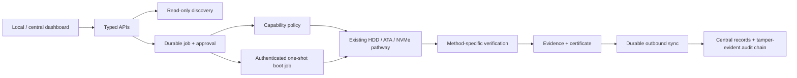

# SIH demo and evaluation packet

All included JSON is explicitly illustrative and contains no real drive identifiers, credentials, or claim of physical validation.

## Architecture

## Threat-model summary

VYPER separates operator sessions, agent credentials, the loopback local API, privileged fixed-function execution, and outbound central synchronization. It fails closed on unknown device identity/topology, requires separate central/local destructive approval, blocks the active system disk in normal mode, and refuses replay in boot mode. Residual risks include privileged-host compromise, firmware misreporting, checksum-only publisher identity, and database-administrator control. See [THREAT_MODEL.md](THREAT_MODEL.md).

## Sanitization and verification tables

| Device evidence | Method | Verification evidence |
|---|---|---|
| Rotational HDD | Host `HDD_OVERWRITE` | Measured bytes plus representative deterministic raw reads |
| ATA security supported and usable | `ATA_ERASE` | Device-reported post-operation ATA security state |
| NVMe SANICAP Crypto | `CRYPTO_ERASE` | Controller sanitize-log/SSTAT completion |
| NVMe SANICAP Block | `BLOCK_ERASE` | Controller sanitize-log/SSTAT completion |
| NVMe SANICAP Overwrite | `NVME_OVERWRITE` | Controller sanitize-log/SSTAT completion |
| Unsupported/unknown capability | No execution | `UNSUPPORTED`/`INCONCLUSIVE`, never a success certificate |

The supported-device truth table is in [HARDWARE_VALIDATION_MATRIX.md](HARDWARE_VALIDATION_MATRIX.md).

## Packet fixtures

- [Sample hardware profile](evidence_packet/sample_hardware_profile.json)
- [Sample evidence](evidence_packet/sample_evidence.json)
- [Sample certificate](evidence_packet/sample_certificate.json)
- [Sample audit chain](evidence_packet/sample_audit_chain.json)
- [Sample boot manifest](evidence_packet/sample_boot_manifest.json)

These placeholders show field shape only; their `illustrative_only` marker means their hashes and results must not be presented as validation evidence.

## Screenshot capture instructions

Capture the download checksum, local discovery with the disposable target highlighted, measured HDD progress, terminal evidence/certificate, central correlation, protected system-disk row, boot manifest, target-validation screen, and fresh confirmation prompt. Crop all hostnames, tokens, usernames, public URLs, and non-demo serial numbers. Add a visible “DRY RUN / MOCKED” banner to system-disk or firmware slides not backed by physical execution.

## Sustainability value

Evidence-backed media disposition can reduce uncertainty that otherwise drives premature shredding. When risk owners can review the method, target identity, outcome, limitations, and integrity metadata, suitable devices can more confidently enter refurbishment, donation, resale, or component-reuse workflows. VYPER does not assert that software evidence overrides organizational policy or hardware failure analysis.

